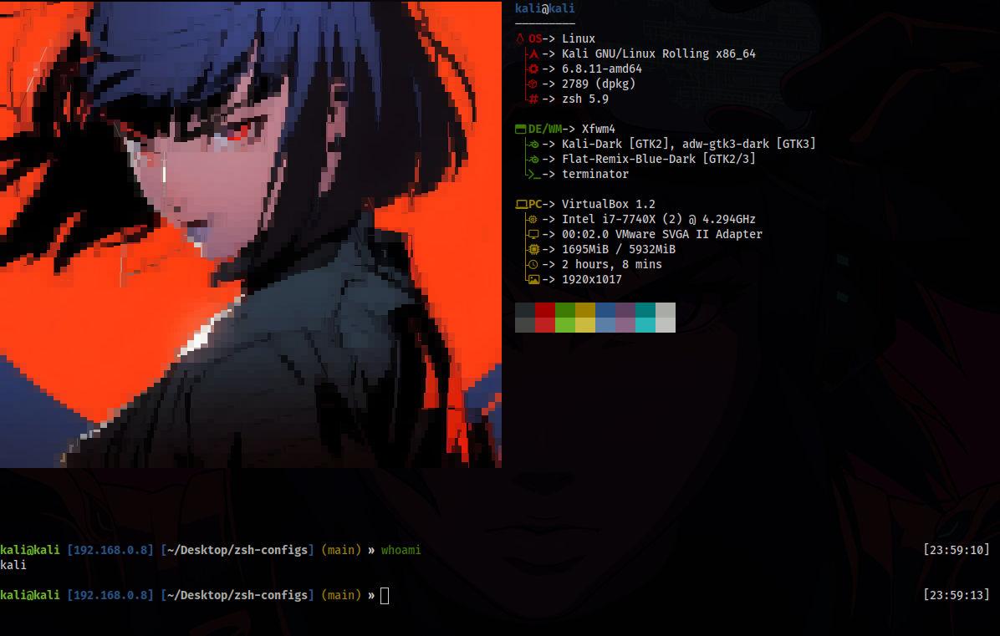
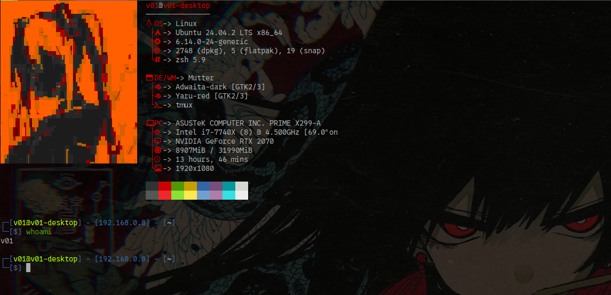

# Zsh Configurations

This repository contains my customized configurations for Oh My Zsh, including themes and plugins. Follow the steps below to install and set up.

<br>

## Plugins and Themes
The repository features lukerandall and duellj themes, both modificated with a customized prompt to display useful information, such as:

* Username and hostname
* IP address (local and VPN)
* Current directory 
* Git status, if inside a Git repository
* Current time displayed on the right

### Lukerandall theme


### Duellj theme


<br>

## Automatic configuration
Clone the repository:

```bash
git clone https://github.com/EndlssNightmare/zsh-configs.git
```
<br>

Execute "setup.sh":

```bash
cd zsh-configs
```
```bash
./setup.sh
```

<br>

To change neofetch's image, edit the file `~/.config/neofetch/config.conf'` and set the path of your image on "image_source" variable:

```bash
image_source="/opt/neofetch-images/guts.jpg"
```

<br>

You can also make your prompt modifications on `~/.oh-my-zsh/themes/lukerandall.zsh-theme`.

<br>

Lastly, reset your terminal:

```bash
source ~/.zshrc
```

